# 🎬 LTX-2.5 Int4 Train — 22B LoRA Trainer for ComfyUI (Low-VRAM)

> **A 22B LTX-2.5 transformer can be LoRA-trained on 12 GB-class GPUs** by combining **4-bit NF4 quantization**, **N-GPU block sharding**, **gradient checkpointing** and **activation tiling** — with the resulting LoRA validated on real data.
>
> 🧪 **Real-world validation:** a **face + voice** LoRA was trained from **138 images + 37 voice segments + speaking-video clips × 2,000 steps** on **2× RTX 3060 12 GB** using the NF4-sharded engine, then **loaded back into LTX-2.5 and generated with strong identity retention.**

This project **experimentally enables LoRA fine-tuning of the LTX-2.5 22B *distilled* transformer** (a distilled model intended for an 8-step inference schedule, not the "trainable" full DiT) using a 4-bit NF4 representation and low-VRAM multi-GPU model sharding — all driven from ComfyUI on Windows.

---

## ❓ Why this matters

```
                    Traditional approach
             ┌───────────────────────────┐
             │      LTX-2.5 22B          │
             │        ~44 GB BF16        │
             └─────────────┬─────────────┘
                           │
                     ❌ 12 GB GPU
                    This project
             ┌─────────────┐ ┌─────────────┐
             │   GPU 0     │ │   GPU 1     │
             │ 24 blocks   │ │ 24 blocks   │
             │  ~6.5 GB    │ │  ~6.5 GB    │
             └──────┬──────┘ └──────┬──────┘
                    └───────┬───────┘
                            │
                       forward/back
                            │
                         LoRA
                            │
                           ✅
```

---

## 🖼️ Real-world LoRA validation

A **face + voice** LoRA was trained from **138 images + 37 voice segments + speaking-video clips** over **2,000 steps** on **2× RTX 3060 12 GB GPUs** using the NF4-sharded training engine. The resulting LoRA was **loaded back into LTX-2.5 and successfully generated** with strong identity retention.

| Original training image | Generated without LoRA | Generated with LoRA |
|---|---|---|
| `results/original.jpg` | `results/without_lora.jpg` | `results/with_lora.jpg` |

> 🖼️ *(Placeholders — drop your real before/after images into `results/` and update this table.)*

The purpose of this test was **not** to find the optimal recipe — it was a **proof-of-concept** that the quantized, sharded training path produces a genuinely useful LoRA under extremely limited VRAM and dataset size.

---

## 🧪 Reproducing the validation result

The published validation configuration used:

| Setting | Value |
|---|---|
| Base | LTX-2.5 22B distilled |
| Quantization | BNB NF4 |
| GPUs | 2× RTX 3060 12 GB |
| Sharding | 24 / 24 transformer blocks |
| Resolution | 512×512 |
| Dataset | 138 images + 37 voice segments + speaking-video clips (face + voice) |
| Steps | 2,000 |
| LoRA rank | 16 |
| Gradient checkpointing | enabled |

The reported LoRA result was generated from the resulting checkpoint using the **same LTX-2.5 base model**.

---

## 🧩 Tested low-VRAM configurations

LTX-2.5 22B distilled transformer · NF4 4-bit · 512×512 training.

| GPU configuration | Blocks/GPU | Measured VRAM / card | Step time |
|---|---|---:|---:|
| 1× RTX 3060 12GB | 48 | ≈11.7 GB | ⏱️ *(measure on next run)* |
| 2× RTX 3060 12GB | 24 + 24 | ≈7.2–7.7 GB | ≈5.96 s avg (0.178 step/s) |
| 3× GPU | 16 + 16 + 16 | ≈4.8 GB | ⏱️ *(measure on next run)* |

> *Measured on this setup; values approximate.* **Theoretical quantized model:** ≈10 GB total. **Measured runtime allocation** (includes shard + overhead): ≈7.2–7.7 GB/card on 2 GPUs, ≈4.8 GB/card on 3 GPUs.

**Important framing:** the goal isn't making 3 GPUs *faster* than 1 — it's making a **22B model trainable within a much smaller per-GPU VRAM budget**.

**Verified:** forward pass, backward pass, finite gradients, LoRA updates, N-GPU model sharding, and sharded-vs-reference correctness testing.

---

## 📊 Benchmark

| Configuration | Measured VRAM/card | Step time | Status |
|---|---:|---:|---|
| 1× RTX 3060 | ≈11.7 GB | ⏱️ *(measure)* | ✅ |
| 2× RTX 3060 | ≈7.2–7.7 GB | ≈5.96 s avg | ✅ |
| 3× GPU | ≈4.8 GB | ⏱️ *(measure)* | ✅ |

> The interesting result isn't a speed race — it's that a 22B transformer fits into a **~7.2 GB/card budget** on 2 GPUs (and ~4.8 GB on 3), which is far below the 32/48 GB a full-precision path typically needs.

### 🚀 We made it faster!

After a training-speed pass (removed per-param host stalls, redundant per-tile barriers, per-step telemetry collectives; loss accumulated on device; coords/samples cached; ETA from an EMA; gradient-checkpointing disabled when tiled), the same 2× RTX 3060 512×512 setup runs **much faster**:

| Metric | Before | After |
|---|---:|---:|
| Step time (overall) | ≈5.96 s | **≈4.75 s** |
| Image clips | — | **≈2.67 s** |
| Voice clips | ≈6–17 s (varies) | **≈5.6 s** |
| Throughput | ≈0.178 step/s | **≈0.21 step/s** |

> Measured on a current 1×1 512×512 face+voice run (2000 steps). Speed is data-dependent — image clips (no audio branch) are faster than voice clips (full video+audio). The bottleneck was host→GPU sync stalls and serialization, not the distributed backend — so NCCL vs gloo alone did **not** change speed (see the WSL note below).

---

## ⚡ NF4 vs. int4 performance observation

> 🧪 *Placeholder — will fill from a dedicated comparison benchmark run.*

On the test system, the **BNB NF4** path reached approximately **0.178 step/s (≈5.96 s/step)** under the tested 512×512 configuration, which is dramatically more practical than the much slower **initial custom int4 path**. This suggests the quantization **representation and kernel implementation matter enormously** for real training throughput — not merely the VRAM saved.

*(The exact NF4-vs-int4 speed-up number will be added after a controlled benchmark run.)*

---

## ✅ Correctness Validation

The N-GPU implementation was compared against an **untiled single-GPU reference**.

| Metric | Single GPU | 2-GPU Sharded |
|---|---|---|
| Loss | 1.0390625 | 1.0390625 |
| LoRA grad energy | 0.0547 | 0.0523 |
| Parameters with gradients | 960 | 960 total |
| Gradients finite | ✓ | ✓ |

The small gradient-energy difference is expected from BF16/FP32/BF16 handoffs at GPU boundaries and gradient-checkpoint recomputation.

**Gate 1 (2-GPU) result:**
- Loss: `1.0390625 → 1.0390625`
- Gradients: `960 total → 480/rank × 2`
- Finite gradients: **PASS**

This is evidence that the sharding isn't merely loading different pieces of the model — **forward + backward actually work.**

**Checks passed:** ✅ identical loss · ✅ finite gradients · ✅ gradients on all expected LoRA params · ✅ forward pass · ✅ backward pass

---

## 🧠 Architecture

```
                    LTX-2.5 22B
                         │
                    NF4 quantization  (≈44 GB → ≈10 GB)
                         │
                  ┌──────┴──────┐
                  │  48 Blocks  │
                  └──────┬──────┘
                         │
          ┌──────────────┼──────────────┐
          ▼              ▼              ▼
       GPU 0           GPU 1          GPU 2
      blocks 0-15     16-31          32-47
          │              │              │
          └──── activations ────────────┘
                         │
                    output / loss
                         │
                    backward
                         ▲
          ┌──────────────┼──────────────┐
          │              │              │
       gradients ← GPU 0 ← GPU 1 ← GPU 2
```

The implementation supports **configurable N-GPU block sharding**, currently **validated on 1, 2, and 3 GPUs**. Each GPU owns a slice of the 48 transformer blocks; activations stream GPU→GPU on forward and gradients propagate in reverse on backward.

This is **model parallelism** rather than conventional **data parallelism**: GPUs do **not** each hold a complete copy of the 22B transformer. Each GPU owns only a subset of transformer blocks and participates in the same forward/backward computation.

### Theoretical vs. measured VRAM (so it's not confusing)
- **Theoretical weight distribution:** ≈10 GB ÷ N
- **Measured runtime VRAM** (includes shard + overhead): **≈7.2–7.7 GB/card on 2 GPUs**, **≈4.8 GB/card on 3 GPUs** for the tested configuration.

---

## 📈 VRAM scaling

The same 48-block transformer was successfully distributed across **1, 2, and 3 GPUs**:

| GPUs | Blocks/GPU | Measured VRAM/card |
|---:|---:|---:|
| 1 | 48 | ≈11.7 GB |
| 2 | 24 | ≈7.2–7.7 GB |
| 3 | 16 | ≈4.8 GB |

The purpose of this scaling is **not** to claim linear speedup. It demonstrates that the model's memory footprint can be **distributed across devices** instead of requiring one GPU to hold the complete transformer.

### 🎯 Why I Built This
LTX-2.5 is a **22B audio/video model**. The limiting factor for most users isn't compute — it's **VRAM**. A 12 GB GPU can do the math but can't hold the full BF16 model *plus* activations, gradients, and training state. This project asks:

> **What if the model doesn't have to live on one GPU?**

The answer: **block-level model parallelism** + **4-bit NF4** + **gradient checkpointing** + **activation tiling**.

### 🪄 "One of the models makes itself smaller"
The Gemma text encoder is loaded with **8-bit quantization** (much smaller VRAM footprint vs BF16), and the 22B transformer goes ≈44 GB BF16 → ≈10 GB NF4. Big model in, small footprint out.

---

## 🧩 What each model does + where it runs

| Model | What it does | Where it runs |
|---|---|---|
| **int4 transformer** (22B → ≈10 GB NF4) | The main video/audio diffusion backbone | sharded across the training GPUs (48 blocks split) |
| **Gemma-4 text encoder** | Turns your prompt into embeddings | first GPU (8-bit), freed after use |
| **embeddings_processor / connectors** | Applies video+audio connectors (background, not on any node) | secondary GPU (during preprocessing) |
| **video VAE** | Encodes your face video → video latents | secondary GPU (during preprocessing) |
| **audio VAE** | Encodes your voice → audio latents | secondary GPU (during preprocessing) |

The **connectors / embeddings_processor** is **applied offline during dataset preprocessing** (and on CPU during generation) — it turns raw text features into the video (4096-dim) + audio (2048-dim) context the transformer expects. It is **not loaded into GPU VRAM during training** (training uses the precomputed, cached embeddings).

---

## ⚙️ The nodes (each node, its settings, what it does)

> Installs as a ComfyUI custom-node bundle. Add the nodes from **Add Node → ltx25-int4-train**.

### 🧩 `O2noor LTX 2.5 Int4 Load Model`
Single **source of truth** for the model + devices.
- **int4_model / connectors / text_encoder / video_vae / audio_vae** — dropdowns auto-populated from ComfyUI's model folders (or config paths).
- **transformer_blocks_gpu0/1/2** — how many of the 48 blocks go to each GPU (the sharding). E.g. `24 / 24 / 0`.
- **connectors_device / video_vae_device / audio_vae_device** — which GPU runs each.

### 🎙️ `O2noor LTX 2.5 Voice Dataset` (voice + face)
Upload **speaking videos** (+ optional face images).
- **mode** — `face+voice` or `face-only`.
- **segment_duration** (s) — clip length (snaps to a valid LTX frame bucket). `1.0s` recommended for voice.
- **max_segments** — cap on clips per video.
- **vae_tile_size** (slider) — VAE-encode tile in pixels; **`0` = auto** (single tile at ≤512×512). Higher = more VRAM per tile, fewer tiles, faster.
- **vae_tile_overlap** (slider) — overlap in pixels between VAE tiles (0–256, default 128); prevents seams only when actually tiling.
- **overwrite** — force re-encode even if latents exist.
- Auto-splits each video into clips and (in voice mode) encodes the voice into `audio_latents/`; **auto re-encodes** any clip whose source changed.

### 🧩 `O2noor LTX 2.5 Int4 Dataset`
The **face-only** dataset builder (upload face images) — the original.

### 📝 `O2noor LTX 2.5 Int4 Encode Captions`
Pre-encodes captions with the Gemma text encoder (optional; auto-run if omitted).

### 🚀 `O2noor LTX 2.5 Int4 Train`
- **run_name** — your LoRA's base name.
- **auto_unique** 🆕 — ON by default: if the output folder exists, it appends a timestamp so **retraining never overwrites the old LoRA**.
- **steps / lr / rank / alpha / checkpoint_interval** — hyper-params.
- **gradient_checkpointing** — ON for low VRAM.
- **tile_config** — optional input from the Tile Config node (below).

### 🧩 `O2noor LTX 2.5 Int4 Tile Config`
Activates **spatial transformer tiling** for training (for VRAM/experiments):
- **horizontal_tiles / vertical_tiles** — grid (e.g. `2×2`, `1×3`, `5×6`); `1×1` = off.
- **overlap** — per-axis tile overlap in latent units (0–16).
- Applies to the **H×W spatial grid** (note: builds the grid string as `vertical × horizontal`). When tiling is active, gradient-checkpointing is auto-disabled (tiling already bounds activation memory → avoids N× recompute).

### 🧩 `O2noor LTX 2.5 Chunk FeedForward`
Low-VRAM FFN chunking for training (returns an `LTX25_MODEL` stamped with `ffn_chunks` / `ffn_dim_threshold`). Splits the feed-forward over the sequence dimension to cut activation peaks.

### 📊 `O2noor LTX 2.5 Metrics Dashboard`
Live dashboard: circular ring, **loss / video loss / audio loss**, **s/step**, **step/s**, **ETA**, **VRAM gpu0/gpu1/total** (bars), **grads**, collapsible **History** chart. Connect its `run` input to the Train node.

### 🖥️ `O2noor LTX 2.5 System Monitor`
Live machine dashboard: **every GPU** (memory used/total, utilization, temperature), **system RAM**, and **CPU** — polled every second. Connect its `run` input to the Train node (wiring only). Shows the real numbers `nvidia-smi` reports (includes CUDA context + embeddings processor), unlike the telemetry's PyTorch-only peak.

### 🔵 `O2noor LTX 2.5 Progress (Live)` / 📄 `O2noor LTX 2.5 Logs/Outputs` / ℹ️ `O2noor LTX 2.5 Summary (Info)`
Live ring + loss chart, aligned per-step log (`(vX/aY)` = video/audio loss), and a rich summary (✅ status, run time, final/video/audio loss, VRAM peak, checkpoints, per-model load times).

---

## 🔄 The workflow (step-by-step tutorial)

```
🧩 O2noor LTX 2.5 Int4 Load Model → 🎙️ O2noor LTX 2.5 Voice Dataset → 📝 O2noor LTX 2.5 Int4 Encode Captions → 🚀 O2noor LTX 2.5 Int4 Train → 📊 O2noor LTX 2.5 Metrics Dashboard
```

1. **O2noor LTX 2.5 Int4 Load Model** — pick the int4 model + VAE + text encoder; set the block split (`24/24` for two GPUs).
2. **O2noor LTX 2.5 Voice Dataset** — upload **speaking videos** (+ optional face images). Set `mode = face+voice`, `segment_duration = 1.0`.
3. **O2noor LTX 2.5 Int4 Encode Captions** — run once to cache prompt embeddings.
4. **O2noor LTX 2.5 Int4 Train** — set `run_name`, `steps` (e.g. 2000), `auto_unique` ON.
5. **Metrics / Progress / Logs / Summary / System Monitor** — watch it live.
6. When it finishes, your LoRA is in `ComfyUI/output/<run_name>_<timestamp>/checkpoints/`.

> 💡 Your **face** comes from the video *and* the images; your **voice** comes from the videos. Video clips train face+voice jointly; image clips reinforce the face.

---

## 🚀 Installation (clone → install → models → run)

The repo **is** a self-contained ComfyUI node pack — `engine/`, `packages/` (vendored `ltx-core`/`ltx-trainer`), `nodes/`, `web/`, and the installer are all at the repo root. Nothing is hardcoded to any machine.

**Easiest (recommended):** in ComfyUI-Manager → **Install Custom Nodes → Install via Git URL**, paste this repo's URL. It clones into `custom_nodes/` and **auto-loads**. Then run the installer below.

**Or manually:**
1. **Clone** this repo.
2. **Install ComfyUI** (comfy.org).
3. **Copy this folder** into ComfyUI's `custom_nodes/`:
   ```bat
   xcopy /E O2noor-comfyui-ltx25-tile-train-Beta D:\ComfyUI\custom_nodes\O2noor-comfyui-ltx25-tile-train-Beta\
   ```
4. **Run the installer** (creates the engine venv, installs deps, writes `config.json`):
   - **Double-click `install.bat`** (auto-detects ComfyUI's Python), **or** run:
   ```bat
   cd D:\ComfyUI\custom_nodes\O2noor-comfyui-ltx25-tile-train-Beta
   python install.py
   ```
   - If the machine has **only ComfyUI** (no standalone Python), use ComfyUI's bundled Python:
   ```bat
   "D:\ComfyUI\.venv\Scripts\python.exe" install.py
   ```
   GPUs are **auto-detected** — no GPU config needed. Use the Tile Config node only if you want a custom split.
5. **Download the 5 models** from Hugging Face (see below) into your ComfyUI model folders.
6. Restart ComfyUI, load `ltx25_int4_train_workflow`, and train. 🎉

> ⚙️ **Before running the installer:** you need **Visual Studio 2022 Build Tools** with the **"Desktop development with C++"** workload (`cl.exe`) for the int4/bnb JIT build. Set `LTX_VCVARS` to your `vcvarsall.bat` if needed.

---

## 🐧 WSL / NCCL (faster multi-GPU backend)

The **native-Windows engine** uses the **gloo** distributed backend (the only backend PyTorch ships on Windows). On multi-GPU sharded training that means CPU/TCP transfers between GPUs.

If you want **faster GPU→GPU communication**, the engine can run inside **WSL2 (Linux)**, where **NCCL** is available. Enable it per-run on the **`O2noor LTX 2.5 Int4 Train`** node with **`use_wsl`**:

> ⚠️ **Measured note:** in testing, enabling NCCL/WSL gave **no observed speedup** — the training bottleneck was **host→GPU sync stalls and per-step serialization**, not the distributed backend's bandwidth (the per-step comm volume is tiny). The speedups came from the training-pass fixes (see "We made it faster!"). So `use_wsl` is **optional** — only use it if it happens to help on your hardware. Speed is the same either way on this setup.

- **`use_wsl = OFF`** → the normal native-Windows engine (gloo), as before.
- **`use_wsl = ON`** → the engine launches via WSL2 with **NCCL** (faster multi-GPU communication). All paths are auto-translated from `D:\…` to `/mnt/d/…` — nothing is hardcoded.

### One-time WSL setup (needed for `use_wsl = ON`)
1. **Install WSL2** (admin PowerShell):
   ```bat
   wsl --install
   ```
   Then **reboot**.
2. Install a distro (Ubuntu is default):
   ```bat
   wsl --install -d Ubuntu
   ```
3. In WSL, create a **Linux engine venv** with the same deps (torch CUDA, bitsandbytes, optimum-quanto, safetensors, pyyaml, ninja) and the vendored `ltx-core`/`ltx-trainer`. Verify NCCL:
   ```bash
   python -c "import torch, torch.distributed as dist; print(dist.is_nccl_available())"   # -> True
   ```
4. Add the WSL paths to your `config.json` (in the node pack folder, generated by `install.py`):
   ```json
   { "wsl_python": "/home/<user>/ltx/.venv/bin/python",
     "wsl_engine_dir": "/mnt/d/LTX-TRAINING/working",
     "wsl_distro": "Ubuntu" }
   ```
   *(Optional: set `wsl_models_dir` to a path in the WSL filesystem, e.g. `~/models`, for faster model I/O than the `/mnt/d` bridge.)*

> ⚠️ NCCL is Linux-only — this is why the WSL route exists. If you don't need faster multi-GPU comm, just leave `use_wsl = OFF`.

---

## 📐 Settings recommendations

### ✅ Do
- Use **`segment_duration = 1.0`** for voice.
- Use a **longer speaking video** (30 s–2 min) so the voice has enough to learn.
- **Vary the background** — otherwise the LoRA memorizes one background instead of your face/voice.
- Keep **`auto_unique = ON`**.
- Use **`gradient_checkpointing = ON`** on 12 GB cards.
- Make sure your face is **visible AND speaking** (lip-synced) for a voice+face LoRA.

### ❌ Don't
- Don't train the voice from only a few seconds of audio.
- Don't use a single fixed background.
- Don't set `frames` (via `segment_duration`) to a non-`8k+1` value.
- Don't expect a voice-only LoRA to add new words — the **script** still comes from the prompt; the LoRA makes the generated voice **sound like you**.
- Don't edit the official `process_videos.py` in the vendored `ltx-trainer`.

> ℹ️ The trainer **supports joint video + audio LoRA training** — a single LoRA can learn visual identity and voice characteristics from synchronized speaking-video data. Whether a particular dataset/config produces a *useful* voice+face LoRA is an **empirical result**, not a guarantee.

---

## 🧩 What this is NOT

This project does **not** invent a new quantization algorithm or a new LoRA algorithm. Its contribution is an **engineering implementation** that combines quantization, model-parallel block sharding, activation transfer, checkpointing, and tiling into a **working LTX-2.5 training pipeline for hardware below the officially recommended VRAM range.**

The project focuses on **systems engineering** rather than introducing a new quantization or optimization algorithm.

---

## 🔬 Experiments & Future Work

### ✅ Multi-axis activation tiling — working experiment
Extending the tiling system to **2×2, 3×3 … 6×6 spatial tiling** with configurable overlap reduces activation memory and allows larger training resolutions. Validated on a full **2×2** run below.

**Measured 2×2 tiling run (`ltx25_train_20260822_225002`):**

| Metric | Value |
|---|---|
| Mode | face + voice (joint video + audio) |
| Resolution | 512×512×25 |
| Tiling | 2×2 (overlap 1) |
| Steps | 1,500 |
| GPUs | 2× RTX 3060 12 GB (int4 NF4) |
| Rank / alpha | 16 / 16 |
| LR | 3e-4 |
| Gradient checkpointing | ON |
| Peak VRAM (both GPUs) | ~14.1 GB |
| Avg throughput | 0.094 step/s (~12.3 s/step) |
| Total time | ~5.1 h (18,501 s) |
| Voice (audio) loss | 1.19 → **0.90** ✅ |
| Face (video) loss | ~2.2 → ~2.6 (full-run avg; noisy, hard clips) |
| Checkpoints | 6 × ~463 MB (steps 250 → 1500) |

**Result:** 2×2 tiling trains a face+voice LoRA comfortably within 2× 12 GB and converges the **voice/audio branch cleanly** (1.19 → 0.90). The **face/video branch** stayed in the ~2–3 range — noisier at 512×512. Both branches share a single LoRA; the audio branch clearly learns.

**Generation samples** (images + video) from this LoRA — *(to be added to `results/tiling-2x2-1500/`)*.

> ⚠️ **Caveat (learned after this run):** the documented 2×2 run trained with `normalize_positions=True`, which **rebased every tile's RoPE to position 0** — that produced a train/inference position mismatch and **noisy/static video** at generation (voice stayed clean because audio isn't tiled). The ~2.4 reported "video loss" was also a **sum-of-tiles artifact** (per-tile it was healthy ~0.6). The fix — **`normalize_positions=False`** (keep absolute tile positions) — is now the default in the engine. So 2×2 and arbitrary grids (1×3, 3×2, 5×6) train with correct orientation and positions; always **verify generation quality** per grid.

### 🔜 Experimental block streaming (future work)
Dynamic transformer-block streaming — a GPU keeps a working set of blocks and replaces completed ones with upcoming ones (reduce peak VRAM, keep the GPU busy). **Experimental until benchmarked.**

---

## 🖼️ LoRA Results

### 138 images + 37 voice segments + speaking-video clips → 2,000 steps
Results generated using the LoRA trained by this project (2× RTX 3060 12 GB, 4-bit NF4, face + voice).

**Measured training outcome (run `ltx25_face_lora_20260822_095830`):**

| Metric | Value |
|---|---|
| Mode | face + voice (joint video + audio) |
| Steps | 2,000 |
| Total time | ≈3.4 h (12,260 s) |
| Avg throughput | 0.178 step/s (~5.96 s/step) |
| Peak VRAM (torch) | gpu0 7.74 / gpu1 7.20 GB (14.94 total) |
| Final video loss (face) | **0.324** |
| Final audio loss (voice) | **0.758** |
| Init time | model load 63.3 s · total 69.8 s |
| Checkpoints | 8 × 463 MB (steps 250 → 2000) |

<table>
<tr><td></td><td></td><td></td></tr>
<tr><td></td><td></td><td></td></tr>
</table>

*(Placeholders — add your generated images to `results/`.)*

A **Original → Without LoRA → With LoRA** comparison would be the most convincing — add those to `results/` and update the table.

### 2,000-step face + voice test — no tile config in training
Training screenshots in order, plus the generated video (folder: `results/2000-steps-voice-face-no-tile-config/`).

<table>
<tr><td>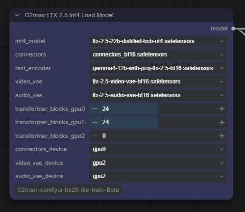</td><td>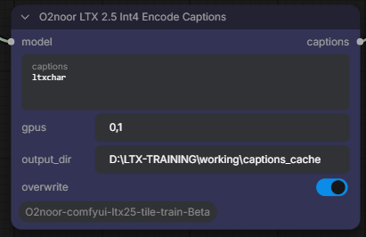</td><td>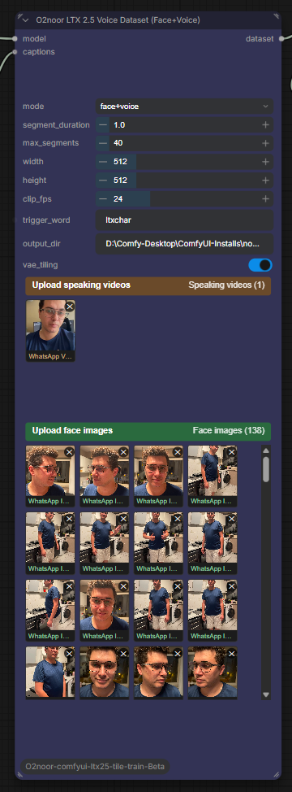</td></tr>
<tr><td>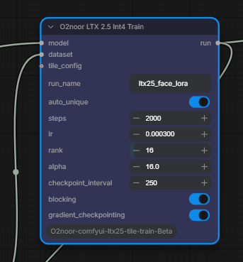</td><td>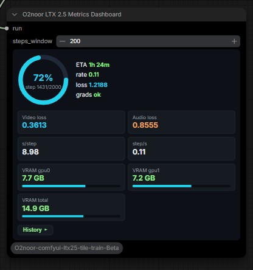</td><td>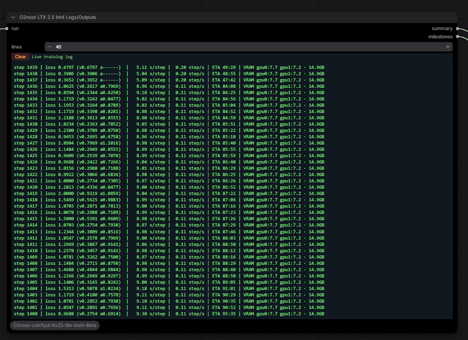</td></tr>
<tr><td>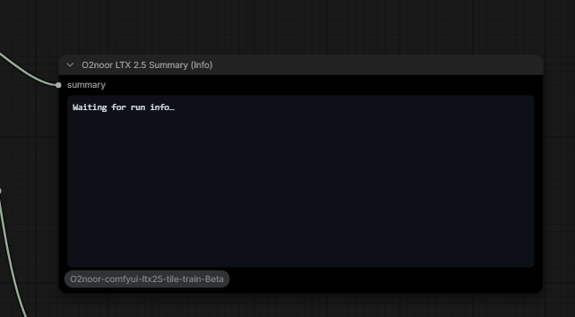</td><td>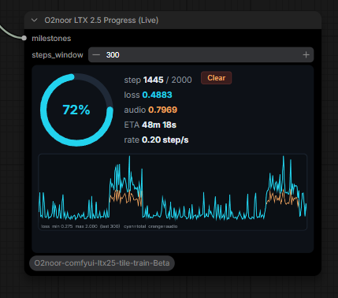</td><td>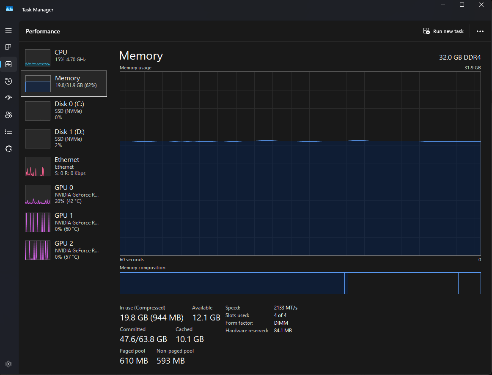</td></tr>
<tr><td>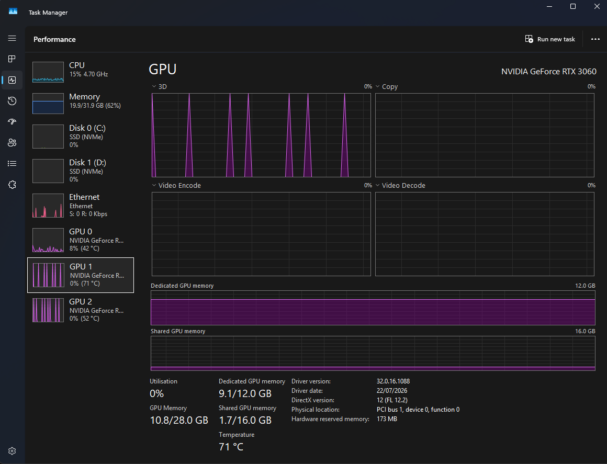</td><td>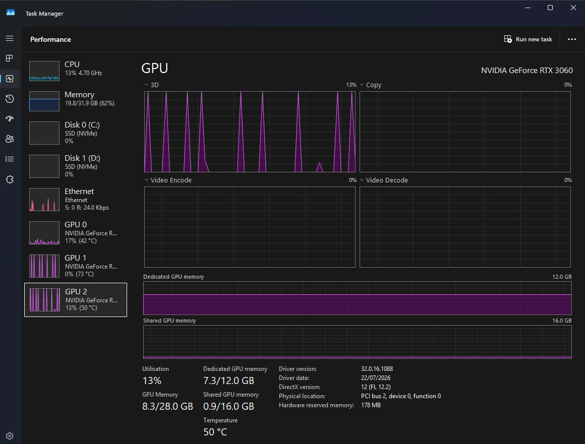</td><td>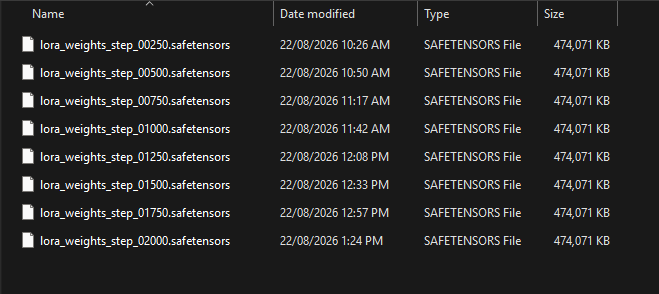</td></tr>
<tr><td>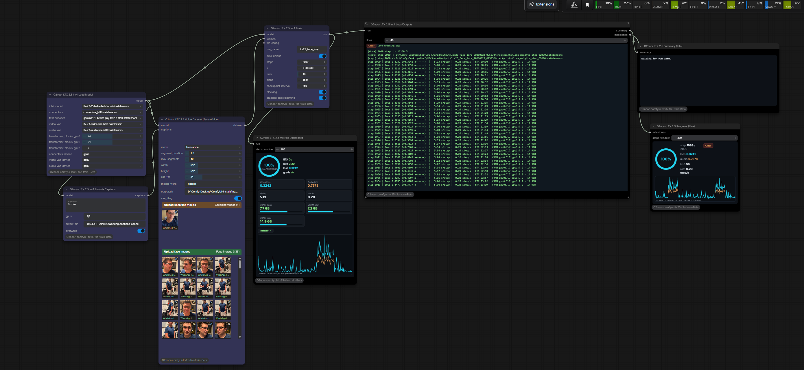</td><td>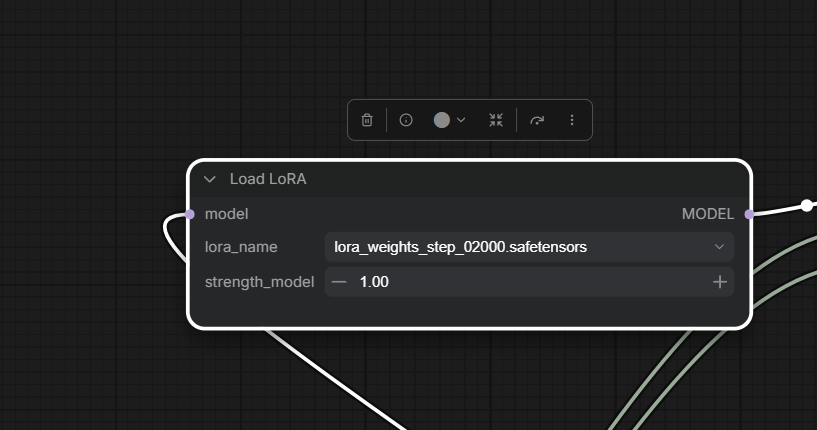</td><td>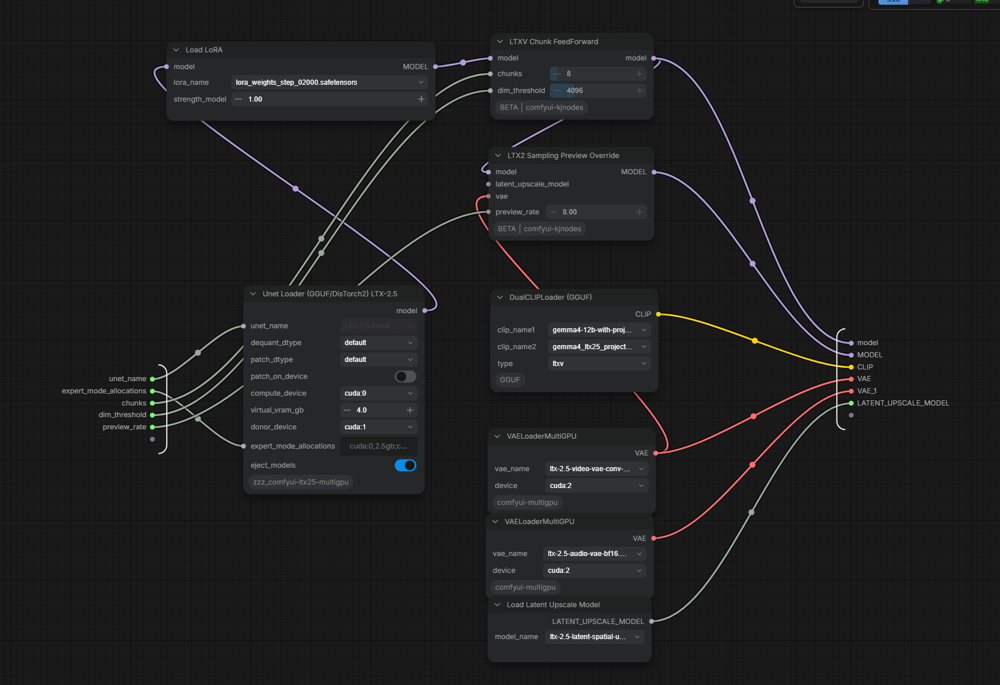</td></tr>
<tr><td>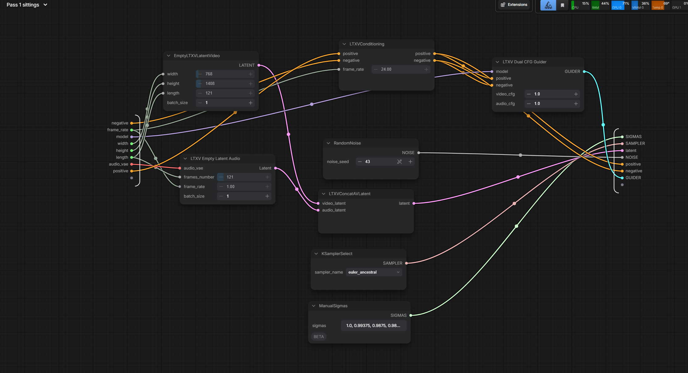</td><td>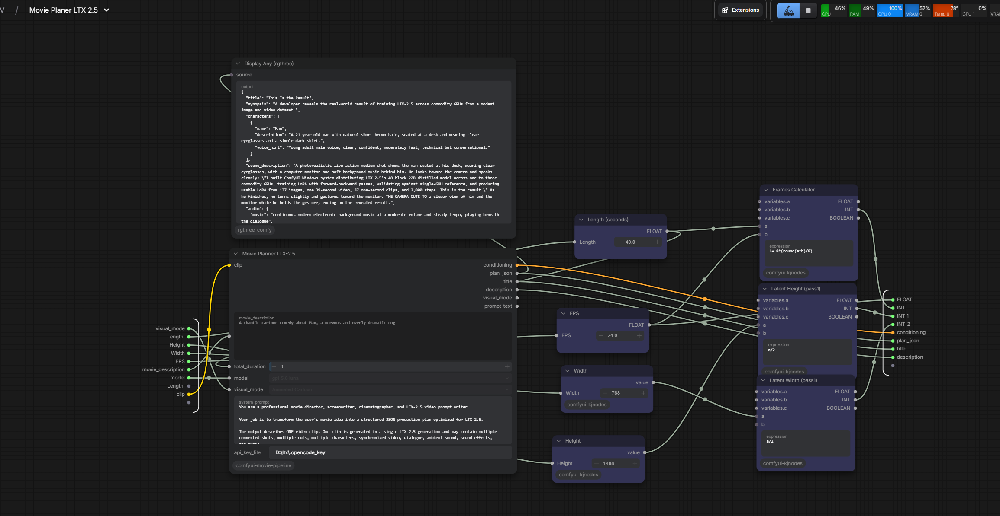</td><td>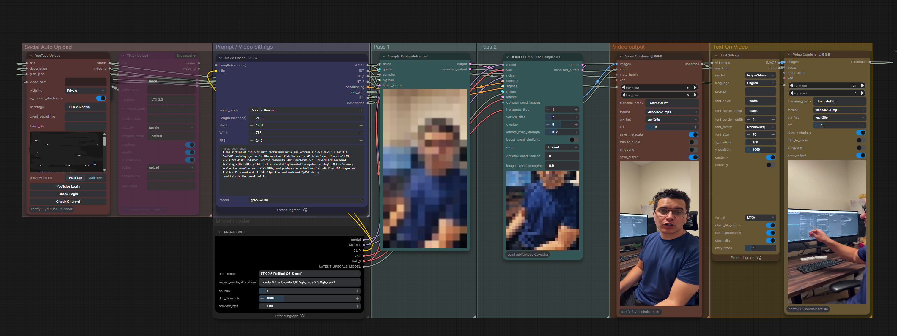</td></tr>
</table>

**Generated video (face + voice):**
[▶ `results/2000-steps-voice-face-no-tile-config/video.mp4`](results/2000-steps-voice-face-no-tile-config/video.mp4)

---

## 🧩 What is actually novel here?

The **engineering contribution** is combining these into a working LTX-2.5 training pipeline:

- 22B LTX-2.5 **distilled** model
- 4-bit **NF4** training
- **N-GPU transformer block sharding**
- GPU-to-GPU **activation pipeline**
- threaded / **reverse backward propagation**
- **gradient checkpointing**
- low-VRAM spatial/temporal **tiling**
- **audio + video** training path
- **ComfyUI** nodes · **Windows** support · **automated installation** · live **dashboard**
- **actual LoRA output validation**

> **The headline isn't "22B fits in 10 GB" (NF4 already does that). It's:** *a 22B LTX-2.5 transformer can be trained with its transformer blocks **distributed across multiple GPUs**, with no single GPU required to hold the entire model* — with forward/backward, gradient, correctness, and real-LoRA evidence behind it.

---

## 📦 Models (Hugging Face)

Download these **5 files** into your model folder (the installer tells you exactly where). The base model is **fully self-contained** — the connectors/aux layers are already merged inside it, so **no separate `connectors_bf16.safetensors` and no quantized cache folders are needed**.

| File | Size | Put in |
|---|---|---|
| `ltx-2.5-22b-distilled-bnb-nf4.safetensors` | ≈10.4 GB | `diffusion_models/` |
| `embeddings_processor_bf16.safetensors` | ≈6.3 GB | `diffusion_models/` |
| `gemma4-12b-with-proj-ltx-2.5-bf16.safetensors` | ≈26 GB | `text_encoders/` |
| `ltx-2.5-video-vae-bf16.safetensors` | ≈1.5 GB | `vae/` |
| `ltx-2.5-audio-vae-bf16.safetensors` | ≈0.36 GB | `vae/` |

> **Prebuilt quantized weights:** See the Hugging Face repository linked below *(you'll add the real link)*.
>
> ⚠️ These weights are **derivatives of LTX-2.5** and remain subject to the **LTX-2.x Community License + Attachment A** — see [Licensing](#️-licensing--model-redistribution).

---

## ⚖️ Licensing / Model redistribution

**Please read this before downloading, using, or redistributing the weights or LoRAs in this repository.**

This repository contains **two distinct things**:

1. **Code** — the installer, ComfyUI nodes, and engine scripts (this project's engineering work), plus the vendored `ltx-core` / `ltx-trainer` packages, which remain under **their own licenses**. The code itself is published under this project's terms.

2. **Model weights & derivatives** — the LTX-2.5 22B distilled model and anything derived from it, including the **quantized (NF4) model** and any **trained LoRA checkpoints**. These are **subject to the [LTX-2.x Community License](https://github.com/Lightricks/LTX-2/blob/main/LICENSE.md)** and its **Attachment A** use restrictions.

**Key points of the LTX-2.x Community License:**

- **"Derivatives of LTX-2.x"** includes fine-tuned/adapted weights and checkpoints derived from LTX-2. Both the **quantized model** and **trained LoRAs** are derivatives.
- **Redistribution is permitted** subject to conditions — the license requires that the **use-based restrictions (Section 4) and all provisions of Attachment A be included as an enforceable provision** in any agreement governing use/distribution, and that you **give notice to subsequent users** that the weights/derivatives are subject to those terms in their entirety.
- **Commercial use:** entities with **annual revenue below $10M** may use, fine-tune, and self-host the model under the community license. Entities at or above **$10M annual revenue** must obtain a **paid commercial license** from Lightricks.
- **No endorsement:** this project is **not affiliated with or endorsed by Lightricks**. The "LTX" name is used only to identify the compatible model.

➡️ **Before downloading, redistributing, or commercially using the weights or any LoRA produced with this tool, review the [full LTX-2.x Community License](https://github.com/Lightricks/LTX-2/blob/main/LICENSE.md) and its Attachment A.** If you are unsure whether your intended use or redistribution is permitted, contact Lightricks to confirm.

> ℹ️ **Recommendation:** rather than hosting the ~10 GB quantized weights directly, you may prefer to distribute the **conversion/quantization scripts** (included here) and link users to the official weights — this reduces the redistribution surface while still being a complete, working project. If you do host the weights or LoRAs, attach the license terms + Attachment A as described above.

---

## ⚠️ Troubleshooting

- **`torchaudio` can't decode audio** → install FFmpeg **shared** DLLs (`winget install BtbN.FFmpeg.GPL.Shared`). `install.py` sets this up.
- **OOM during voice+face** → the audio connector is **precomputed** (default) so the embeddings processor isn't on the GPUs during training.
- **Stale-latent shape error** → the dataset node clears `latents/audio_latents/conditions` before each run; delete the dataset folder if it persists.
- **Wrong `frames` bucket** → keep `segment_duration` so it snaps to a valid `8k+1` count.
- **`cl.exe` / JIT build errors** → install VS 2022 Build Tools (C++ workload) or set `LTX_VCVARS`.

---

## 📜 License & Credits

- LTX-2.5 by Lightricks. `ltx-core` / `ltx-trainer` under their respective licenses.
- This pack is an independent training tool. Models follow their own licenses (see **Licensing**).
